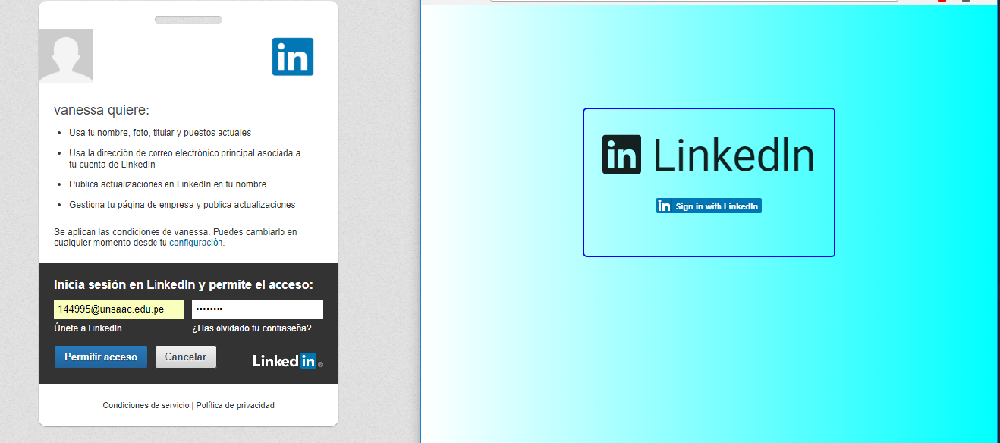

# LINKEDLN

> Recuerda seguir siempre esta [guía de estilos](https://github.com/Laboratoria/js-style-guide/)

Que la fuerza te acompañe en este ejercicio, revisa las siguientes slides para que puedas crear esta fenómenal app

___

### Objetivos
Aprender sobre apis y xhr  poniendo en practica todo lo aprendido en clases

### Organizacion del trabajo

* Creando estructura de carpetas respectivamente.
* Indagando y explorando  la API de linkendln.
* Recorriendo json para observar que datos nos ofrece la API(nombre, apellido, estudio y la url del perfil de linkendln).
* Haciendo maquetado simple.
* Poniendo estilos.
* Trabajando en funcionalidad.
* Finalmente el trabajo queda asi:

